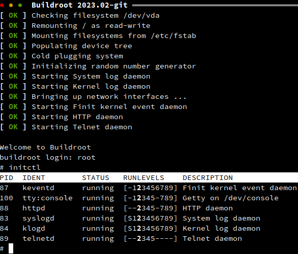

Buildroot Demo with Fast Init
=============================

This is an example of how [Finit][1] can be used with Buildroot instead
of the default BusyBox init, or systemd.

The provided defconfig (see below) is the default Buildroot Qemu x86_64
defconfig, with Finit enabled as the default system init.  The kernel is
the same as Buildroot, targeting only a basic Qemu PC machine.  The root
filesystem (ext4) is built around BusyBox, with the following changes:

 - Disable BusyBox init
 - Disable BusyBox poweroff/halt/reboot commands (for init)
 - Enable mount helpers (for fstab tricks later)
 - Enable a few services: `httpd`, `ntpd`, `udhcpd`, `dnsd`, `telnetd`, ...

The rest of this tree is basically just glue to make everything fit in
with the Buildroot external concept, as described in the [excellent
manual][3].  Check it out for helpful hints and how to extend on this
demo with more services, or even customize it for your own project.

> Notice the use of an external, `br2-ext-finit`, providing only the
> necessary Finit package(s) and a root skeleton with a wide range of
> service configurations.  If you already have a Buildroot system, it
> comes with all you need to get up and running.

Build
-----

To build, first clone this repository to your host system, change to
the top-level directory, activate the defconfig and make:

    git clone https://github.com/troglobit/br2-finit-demo.git
    cd br2-finit-demo/
    make qemu_x86_64_finit_defconfig
    make

The resulting image files are placed `output/images/` and a Qemu host
program is available in `output/host/bin/`.

> The host requirements are the same as Buildroot proper, for details,
> see <https://buildroot.org/downloads/manual/manual.html#requirement>

Run
---

The `external.mk` file extends Buildroot with a `run` command that calls
the Qemu host program with the generated image files:

    make run

It boots fairly quick provided you have an x86_64 host computer.  See
the `initctl` tool (below) to control Finit.

Default login is `root`, no password.

> **Note:** use `Ctrl-a x` to exit qemu, and `Ctrl-a c` to toggle console/monitor

Usage
-----

Finit is controlled by its helper tool `initctl`:

    initctl help

Brings up the available commands.  Check what is running right now:

    initctl status   # default command, you can omit 'status'

Show available .conf snippets that start services:

    initctl ls

Configuration files are in `/etc/finit.conf` and `/etc/finit.d/*`, the
latter support Apache-like `available/` and `enabled/` configuration
snippets.

Try enabling some services (not a lot is enabled in the defconfig, add
more with `make menuconfig` or `make busybox-menuconfig`) like:

    initctl enable telnetd

Try `initctl ls` again, it's now listed in the set of enabled services.
But it's not yet running ... (check with `initctl status`).  This is
because we may want to roll out multiple changes to a system before
activating them.  To activate we tell Finit to reload its configuration.

    initctl reload

Verify it is now running.  For more detailed information about telnetd:

    initctl status telnetd

Try killing telnetd and check the status again.  You can now see that
Finit has already restarted it for you (`Restarts: 1 (1/10)`).  Kill it
a few more times to see what happens.  When a service reaches its max
restart count Finit will no longer try to restart it automatically --
something is obviously not right with the service.  You will have to
restart it manually, which clears the restart counter.  Notice how the
total restarts counter continues counting.

Access
------

To be able to run Qemu unprivileged, without sudo, the guest runs in
user networking mode.  Meaning the guest is hidden behind a NAT and
regular services cannot be reached without a port forward.

When calling `make run` the following ports are forwarded from the guest
to the host's 80xx port range:

| **Service** | **Guest port** | **Host port** |
|-------------|----------------|---------------|
| FTP         | 21             | tcp/8021      |
| SSH         | 22             | tcp/8022      |
| Telnet      | 23             | tcp/8023      |
| HTTP        | 80             | tcp/8080      |

So, to test login via telnet from your host:

    telnet localhost 8023

or if you want test the web server (enabled by default):

    x-www-browser http://localhost:8080       # Debian/Ubuntu/Mint shortcut

You can even reach it from another host on your LAN by replacing the
`localhost` name with the name, or IP address, of the host you are
running Qemu on.

Fin
---

There is of course a lot more to cover.  Please let me know if you are
curious about some other aspect that would be suitable for a blog post.
There is also a [discussion forum][2] open for general questions about
[Finit][1].

[1]: https://github.com/troglobit/finit#introduction
[2]: https://github.com/troglobit/finit/discussions
[3]: https://buildroot.org/downloads/manual/manual.html
